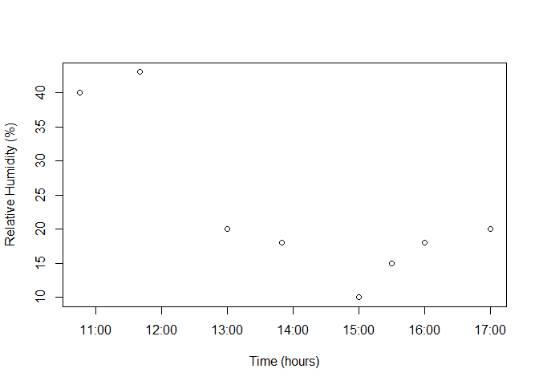

Exercise 1 - R Fire Weather Data Science
================

Applied Fire Data Science
=========================

Playing with toy data is all well and good, but often we want to play with our own fire data and explore it.

Objectives:

-   Load, clean, and plot our own fire weather data

Loading Data
------------

If you haven't downloaded the .csv for the SkunkFireWxObs.csv, get it [here](https://raw.githubusercontent.com/danielg7/FireWeatherDataAnalyses/master/Data/SkunkFireWxObs.csv) and put it in a 'Data' folder in your working directory.

Let's load in data from a FEMO on the fictional Skunk Prescribed Fire. Hopefully, the results won't stink:

``` r
skunkData <- read.csv("Data/SkunkFireWxObs.csv")
```

Whenever we load in data, we want to look at it. There are a number of ways to do that.

First, we can look at what the first couple of lines of the dataframe look like:

``` r
head(skunkData)
```

    ##      ï..Date Time Dry_F Wet_F RH_Per WindSpeed_mph CloudCover_Perc
    ## 1 09/22/2018 1045    46    NA     40             3               1
    ## 2 09/22/2018 1140    50    NA     43             7               1
    ## 3 09/22/2018 1300    55    NA     20             5               1
    ## 4 09/22/2018 1350    54    NA     18             4               1
    ## 5 09/22/2018 1500    60    NA     10             3               1
    ## 6 09/22/2018 1530    65    NA     15             4               1
    ##   FDFM_Unshaded FDFM_Shade POI_Unshaded POI_Shaded              Location
    ## 1            NA         NA           NA         NA                  DP10
    ## 2            NA         NA           NA         NA                  DP10
    ## 3            NA         NA           NA         NA                  DP10
    ## 4            NA         NA           NA         NA                  DP20
    ## 5            NA         NA           NA         NA Between DP20 and DP30
    ## 6            NA         NA           NA         NA Between DP20 and DP30

Interesting. What kind of data types are there?

``` r
str(skunkData)
```

    ## 'data.frame':    8 obs. of  12 variables:
    ##  $ ï..Date        : Factor w/ 1 level "09/22/2018": 1 1 1 1 1 1 1 1
    ##  $ Time           : int  1045 1140 1300 1350 1500 1530 1600 1700
    ##  $ Dry_F          : int  46 50 55 54 60 65 67 70
    ##  $ Wet_F          : logi  NA NA NA NA NA NA ...
    ##  $ RH_Per         : int  40 43 20 18 10 15 18 20
    ##  $ WindSpeed_mph  : int  3 7 5 4 3 4 3 2
    ##  $ CloudCover_Perc: int  1 1 1 1 1 1 1 0
    ##  $ FDFM_Unshaded  : logi  NA NA NA NA NA NA ...
    ##  $ FDFM_Shade     : logi  NA NA NA NA NA NA ...
    ##  $ POI_Unshaded   : logi  NA NA NA NA NA NA ...
    ##  $ POI_Shaded     : logi  NA NA NA NA NA NA ...
    ##  $ Location       : Factor w/ 5 levels "Between DP20 and DP30",..: 4 4 4 5 1 1 2 3

We see a few things here. First, the "Date" column is misname. Let's rename it.

First, let's look at the first column of the dataframe:

``` r
names(skunkData)[1]
```

    ## [1] "ï..Date"

Great, that's definitely the offending column name. Let's fix it! How can we do that?

``` r
names(skunkData)[1] <- "Date"
```

Did it work? Let's check.

``` r
names(skunkData)
```

    ##  [1] "Date"            "Time"            "Dry_F"          
    ##  [4] "Wet_F"           "RH_Per"          "WindSpeed_mph"  
    ##  [7] "CloudCover_Perc" "FDFM_Unshaded"   "FDFM_Shade"     
    ## [10] "POI_Unshaded"    "POI_Shaded"      "Location"

Awesome!

Very Important Dates
--------------------

For anyone that's fought with dates in Excel, you're in luck! Dates are easier to handle (but still tricky) in R.

Look again at the `str(skunkData)`. What kind of variable is `Date`? What kind of variable is `Time`?

What if we wanted to plot these points? We would need to combine the `Date` and `Time` columns into a new column, first. We'll need to use the `paste()` function to do that.

Let's look up how to use that:

``` r
?paste
```

Now that we know more about it, let's make a new column that combines `Date` and `Time`:

``` r
skunkData$DateTime <- paste(skunkData$Date, skunkData$Time, sep = " ")

head(skunkData)
```

    ##         Date Time Dry_F Wet_F RH_Per WindSpeed_mph CloudCover_Perc
    ## 1 09/22/2018 1045    46    NA     40             3               1
    ## 2 09/22/2018 1140    50    NA     43             7               1
    ## 3 09/22/2018 1300    55    NA     20             5               1
    ## 4 09/22/2018 1350    54    NA     18             4               1
    ## 5 09/22/2018 1500    60    NA     10             3               1
    ## 6 09/22/2018 1530    65    NA     15             4               1
    ##   FDFM_Unshaded FDFM_Shade POI_Unshaded POI_Shaded              Location
    ## 1            NA         NA           NA         NA                  DP10
    ## 2            NA         NA           NA         NA                  DP10
    ## 3            NA         NA           NA         NA                  DP10
    ## 4            NA         NA           NA         NA                  DP20
    ## 5            NA         NA           NA         NA Between DP20 and DP30
    ## 6            NA         NA           NA         NA Between DP20 and DP30
    ##          DateTime
    ## 1 09/22/2018 1045
    ## 2 09/22/2018 1140
    ## 3 09/22/2018 1300
    ## 4 09/22/2018 1350
    ## 5 09/22/2018 1500
    ## 6 09/22/2018 1530

``` r
str(skunkData)
```

    ## 'data.frame':    8 obs. of  13 variables:
    ##  $ Date           : Factor w/ 1 level "09/22/2018": 1 1 1 1 1 1 1 1
    ##  $ Time           : int  1045 1140 1300 1350 1500 1530 1600 1700
    ##  $ Dry_F          : int  46 50 55 54 60 65 67 70
    ##  $ Wet_F          : logi  NA NA NA NA NA NA ...
    ##  $ RH_Per         : int  40 43 20 18 10 15 18 20
    ##  $ WindSpeed_mph  : int  3 7 5 4 3 4 3 2
    ##  $ CloudCover_Perc: int  1 1 1 1 1 1 1 0
    ##  $ FDFM_Unshaded  : logi  NA NA NA NA NA NA ...
    ##  $ FDFM_Shade     : logi  NA NA NA NA NA NA ...
    ##  $ POI_Unshaded   : logi  NA NA NA NA NA NA ...
    ##  $ POI_Shaded     : logi  NA NA NA NA NA NA ...
    ##  $ Location       : Factor w/ 5 levels "Between DP20 and DP30",..: 4 4 4 5 1 1 2 3
    ##  $ DateTime       : chr  "09/22/2018 1045" "09/22/2018 1140" "09/22/2018 1300" "09/22/2018 1350" ...

Great! Let's use a basic plotting function to look at our data.

``` r
plot(skunkData$DateTime, skunkData$RH_Per)
```

    ## Warning in xy.coords(x, y, xlabel, ylabel, log): NAs introduced by coercion

    ## Warning in min(x): no non-missing arguments to min; returning Inf

    ## Warning in max(x): no non-missing arguments to max; returning -Inf

    ## Error in plot.window(...): need finite 'xlim' values


Unfortunately, the data aren't in a time format that R recognizes and R is throwing a vague and somewhat unhelpful error (with gratuitous and obnoxious extra linebreaks, to boot!). If you look above, DateTime is a `chr` object - character! To do convert them into dates, let's use the `lubridate` package.

First, we'll need to install it and activate it:

``` r
install.packages("lubridate")

library("lubridate")
```

There's a lot that lubridate can do, but one of the easiest helper functions allows you to take different formats of dates and times and convert them into formats that R can read. The commands follow the flow of the date/times:

-   `dmy()` = "Day / Month / Year"
-   `myd()` - "Month / Year / Day"
-   `ymd()` = "Year / Month / Day"
-   `ymd_hms()` = "Year / Month / Day / Hours / Minutes / Seconds"
-   `ymd_hm()` = "Year / Month / Day / Hours / Minutes" etc

`lubridate` automagically parses any format that matches whatever combination your dates or date/times are in, whether there are spaces, slashes, or whatever in between.

Let's use this to parse the DateTime column, making sure to define the timezone with the argument "tz":

``` r
skunkData$DateTime <- mdy_hm(skunkData$DateTime, tz = "MST")

str(skunkData)
```

    ## 'data.frame':    8 obs. of  13 variables:
    ##  $ Date           : Factor w/ 1 level "09/22/2018": 1 1 1 1 1 1 1 1
    ##  $ Time           : int  1045 1140 1300 1350 1500 1530 1600 1700
    ##  $ Dry_F          : int  46 50 55 54 60 65 67 70
    ##  $ Wet_F          : logi  NA NA NA NA NA NA ...
    ##  $ RH_Per         : int  40 43 20 18 10 15 18 20
    ##  $ WindSpeed_mph  : int  3 7 5 4 3 4 3 2
    ##  $ CloudCover_Perc: int  1 1 1 1 1 1 1 0
    ##  $ FDFM_Unshaded  : logi  NA NA NA NA NA NA ...
    ##  $ FDFM_Shade     : logi  NA NA NA NA NA NA ...
    ##  $ POI_Unshaded   : logi  NA NA NA NA NA NA ...
    ##  $ POI_Shaded     : logi  NA NA NA NA NA NA ...
    ##  $ Location       : Factor w/ 5 levels "Between DP20 and DP30",..: 4 4 4 5 1 1 2 3
    ##  $ DateTime       : POSIXct, format: "2018-09-22 10:45:00" "2018-09-22 11:40:00" ...

And now let's plot it again:

``` r
plot(skunkData$DateTime, skunkData$RH_Per)
```



Great! It works now!

Let's save this file so that we can use it again:

``` r
write.csv(x = skunkData, file = "skunkData_dateAdded.csv",row.names = FALSE)
```

Challenge
=========

-   Plot temperature from the skunk fire data
