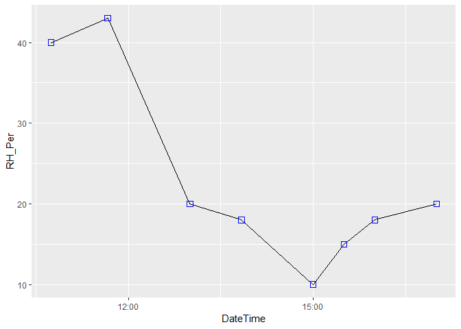

Exercise 2 - Downloading Fire Weather Data
================

Objectives
==========

-   Plot using basic plots with ggplot2
-   Download data from riem (install packages)

Turning on the libraries we will need:
--------------------------------------

Let's load the `ggplot2` library.

``` r
library("ggplot2")
library("lubridate")
```

    ## 
    ## Attaching package: 'lubridate'

    ## The following object is masked from 'package:base':
    ## 
    ##     date

...and load in your Skunk Fire data that you saved before. Also, fix the dates with `lubridate`, as before.

``` r
skunkData_reloaded <- read.csv("Data/skunkData_dateAdded.csv")
skunkData_reloaded$DateTime <- ymd_hms(skunkData_reloaded$DateTime,tz = "MST")
```

Plotting Your Data
------------------

Now that we know a bit about plotting, let's plot our own data.

Let's plot RH over time using lines:

``` r
p <- ggplot(data = skunkData_reloaded, aes(x = DateTime, y = RH_Per))
p+
  geom_line()
```


Let's change the thickness of the line:

``` r
p+
  geom_line(size = 3)
```


Hmm. That's a bit too big. Let's go back to the default.

Let's add points:

``` r
p+
  geom_line()+
  geom_point()
```


We can also change the color of points

``` r
p+
  geom_line()+
  geom_point(color = "red")
```


or the shape and size (try googling for "r shape" for ggplot2 point shape references)...

``` r
p+
  geom_line()+
  geom_point(shape = 22, size = 3, color = "blue")
```



We can also clean it up a little:

``` r
p+
  geom_line()+
  geom_point()+
  xlab("Time")+
  ylab("RH (%)")+
  labs(title = "Skunk Fire Weather Observations",
       subtitle = "This is a subtitle",
       caption = "Source: Jane Q. Femo")+
  theme_bw()
```


### Challenge

-   Plot temperature with ggplot2 against time
-   Change the point color to green
-   Change the point shape to a triangle

Downloading new data
--------------------

### Installing riem

Let's download some nearby weather observations and plot them alongside these data.

First, let's download the `riem` R package, a wrapper for the Iowa Environmental Mesonet. It's a package that allows you to download weather data from National Weather Service Automated Surface Observing System (ASOS) stations. Basically, these are associated with airports.

``` r
install.packages("riem")
library("riem")
```

Great! Hopefully no errors.

### Downloading data

We will use the `riem_measures` function, explained in documentation [here](http://ropensci.github.io/riem/reference/riem_measures.html).

The closest ASOS station to the Skunk Fire is FNL, so let's download the corresponding date:

``` r
FCO <- riem_measures("FNL", date_start = "2018-09-22", date_end = "2018-09-24")
```

Great! Let's take a look at how the data are structured and plot it:

``` r
str(FCO)
```

    ## Classes 'tbl_df', 'tbl' and 'data.frame':    626 obs. of  31 variables:
    ##  $ station          : chr  "FNL" "FNL" "FNL" "FNL" ...
    ##  $ valid            : POSIXct, format: "2018-09-22 00:00:00" "2018-09-22 00:05:00" ...
    ##  $ lon              : num  -105 -105 -105 -105 -105 ...
    ##  $ lat              : num  40.5 40.5 40.5 40.5 40.5 ...
    ##  $ tmpf             : num  NA NA NA NA NA NA NA NA NA NA ...
    ##  $ dwpf             : num  NA NA NA NA NA NA NA NA NA NA ...
    ##  $ relh             : num  NA NA NA NA NA NA NA NA NA NA ...
    ##  $ drct             : num  120 120 110 110 110 110 110 110 110 110 ...
    ##  $ sknt             : num  6 8 8 12 10 9 10 10 10 9 ...
    ##  $ p01i             : num  NA NA NA NA NA NA NA NA NA NA ...
    ##  $ alti             : num  30.2 30.2 30.2 30.2 30.2 ...
    ##  $ mslp             : num  NA NA NA NA NA NA NA NA NA NA ...
    ##  $ vsby             : num  10 10 10 10 10 10 10 10 10 10 ...
    ##  $ gust             : num  NA NA NA NA NA NA NA NA NA NA ...
    ##  $ skyc1            : chr  "CLR" "CLR" "CLR" "CLR" ...
    ##  $ skyc2            : logi  NA NA NA NA NA NA ...
    ##  $ skyc3            : logi  NA NA NA NA NA NA ...
    ##  $ skyc4            : logi  NA NA NA NA NA NA ...
    ##  $ skyl1            : logi  NA NA NA NA NA NA ...
    ##  $ skyl2            : logi  NA NA NA NA NA NA ...
    ##  $ skyl3            : logi  NA NA NA NA NA NA ...
    ##  $ skyl4            : logi  NA NA NA NA NA NA ...
    ##  $ wxcodes          : chr  NA NA NA NA ...
    ##  $ ice_accretion_1hr: logi  NA NA NA NA NA NA ...
    ##  $ ice_accretion_3hr: logi  NA NA NA NA NA NA ...
    ##  $ ice_accretion_6hr: logi  NA NA NA NA NA NA ...
    ##  $ peak_wind_gust   : logi  NA NA NA NA NA NA ...
    ##  $ peak_wind_drct   : logi  NA NA NA NA NA NA ...
    ##  $ peak_wind_time   : logi  NA NA NA NA NA NA ...
    ##  $ feel             : num  NA NA NA NA NA NA NA NA NA NA ...
    ##  $ metar            : chr  "KFNL 220000Z AUTO 12006G00KT 10SM CLR 25/05 A3018 RMK T02500050 MADISHF" "KFNL 220005Z AUTO 12008G00KT 10SM CLR 25/05 A3017 RMK T02500050 MADISHF" "KFNL 220010Z AUTO 11008G00KT 10SM CLR 25/06 A3017 RMK T02500060 MADISHF" "KFNL 220015Z AUTO 11012G00KT 10SM CLR 24/05 A3017 RMK T02400050 MADISHF" ...

``` r
head(FCO)
```

    ## # A tibble: 6 x 31
    ##   station valid                 lon   lat  tmpf  dwpf  relh  drct  sknt
    ##   <chr>   <dttm>              <dbl> <dbl> <dbl> <dbl> <dbl> <dbl> <dbl>
    ## 1 FNL     2018-09-22 00:00:00 -105.  40.5    NA    NA    NA   120     6
    ## 2 FNL     2018-09-22 00:05:00 -105.  40.5    NA    NA    NA   120     8
    ## 3 FNL     2018-09-22 00:10:00 -105.  40.5    NA    NA    NA   110     8
    ## 4 FNL     2018-09-22 00:15:00 -105.  40.5    NA    NA    NA   110    12
    ## 5 FNL     2018-09-22 00:20:00 -105.  40.5    NA    NA    NA   110    10
    ## 6 FNL     2018-09-22 00:25:00 -105.  40.5    NA    NA    NA   110     9
    ## # ... with 22 more variables: p01i <dbl>, alti <dbl>, mslp <dbl>,
    ## #   vsby <dbl>, gust <dbl>, skyc1 <chr>, skyc2 <lgl>, skyc3 <lgl>,
    ## #   skyc4 <lgl>, skyl1 <lgl>, skyl2 <lgl>, skyl3 <lgl>, skyl4 <lgl>,
    ## #   wxcodes <chr>, ice_accretion_1hr <lgl>, ice_accretion_3hr <lgl>,
    ## #   ice_accretion_6hr <lgl>, peak_wind_gust <lgl>, peak_wind_drct <lgl>,
    ## #   peak_wind_time <lgl>, feel <dbl>, metar <chr>

``` r
plot(FCO$relh~FCO$valid)
```


Close readers may note that this is not a dataframe but a tibble.

Now let's overlay it with our data. How can we do that?

``` r
p2 <- ggplot()+
  xlab("Date / Time")+
  ylab("RH")+
  geom_point(color = "black", data = FCO, aes(x = valid, y = relh))+
  geom_point(color = "red", data = skunkData_reloaded, aes(x = DateTime, y = RH_Per))+
  labs(title = "Skunk Fire Weather Observations",
       subtitle = "This is a subtitle",
       caption = "Source: Jane Q. Femo")+
  theme_bw()

p2
```

    ## Warning: Removed 569 rows containing missing values (geom_point).


Uh oh, that looks weird. Maybe the time zones are off? Let's check it! And FIX IT!

``` r
tz(FCO$valid)
```

    ## [1] "UTC"

``` r
FCO$DateTime <- with_tz(FCO$valid, "MST")
```

Let's plot this again.

``` r
p2 <- ggplot()+
  xlab("Date / Time")+
  ylab("RH")+
  geom_point(color = "black", data = FCO, aes(x = DateTime, y = relh))+
  geom_point(color = "red", data = skunkData_reloaded, aes(x = DateTime, y = RH_Per))+
  labs(title = "Skunk Fire Weather Observations",
       subtitle = "This is a subtitle",
       caption = "Source: Jane Q. Femo")+
  theme_bw()

p2
```

    ## Warning: Removed 569 rows containing missing values (geom_point).


Cool!

How can we make this look nicer, though?

Let's use the package `cowplot`, which is a wrapper for `ggplot2` that improves some of the plotting functions. `cowplot` can do all kinds of nifty things. Check out the vignettes [here](https://cran.r-project.org/web/packages/cowplot/vignettes/introduction.html).

Go ahead and install it and switch the theme to `theme_cowplot()`

``` r
library(cowplot)
```

    ## 
    ## Attaching package: 'cowplot'

    ## The following object is masked from 'package:ggplot2':
    ## 
    ##     ggsave

``` r
p2 <- ggplot()+
  xlab("Date / Time")+
  ylab("RH (%)")+
  geom_point(color = "black", data = FCO, aes(x = DateTime, y = relh))+
  geom_point(color = "red", data = skunkData_reloaded, aes(x = DateTime, y = RH_Per))+
  labs(title = "Skunk Fire Weather Observations",
       subtitle = "This is a subtitle",
       caption = "Source: Jane Q. Femo")+
  theme_cowplot()

p2
```

    ## Warning: Removed 569 rows containing missing values (geom_point).


Looking good! Let's play with dates some more and fix the scale to just show one day. We will need to use the `scale_x_datetime` scale function, which takes values for limits.

This is a bit advanced but with some good googling for "POSIXct", "ggplot2", and "scale\_x\_datetime", I bet you can find the answer...

Stack Overflow to the rescue!

``` r
p2 <- ggplot()+
  xlab("Date / Time")+
  ylab("RH (%)")+
  scale_x_datetime(limits = ymd_h(c("2018-09-22 08", "2018-09-22 20"),tz = "MST"))+
  geom_point(color = "black", data = FCO, aes(x = DateTime, y = relh))+
  geom_point(color = "red", data = skunkData_reloaded, aes(x = DateTime, y = RH_Per))+
  labs(title = "Skunk Fire Weather Observations",
       caption = "Source: Jane Q. Femo")+
  theme_cowplot()

p2
```

    ## Warning: Removed 606 rows containing missing values (geom_point).


Now we're cooking with gas. Let's save this using the `ggsave` function. There are many different arguments for `ggsave()` to change the size and format.

``` r
ggsave(plot = p2, filename = "SkunkFireRH.png")
```

    ## Saving 7 x 5 in image

    ## Warning: Removed 606 rows containing missing values (geom_point).

### Challenge

-   Plot the temperature from the Skunk Fire in green and the temperature (tmpf) of from the FCO airport data in red squares (shape 15)
-   Change the title of the plot to "Skunk Fire Weather: On-Site and Regional Comparison"
-   Save the plot as "SkunkFireTemperature.png"

Things To Remember
==================

-   Plotting with ggplot2
-   Downloading data with `riem` and visualizing it
-   Plotting two different data types with ggplot2
-   Saving plots with `ggsave()`
