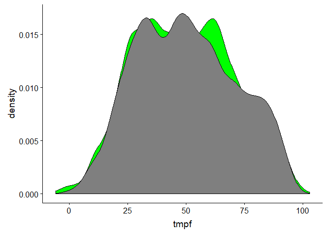
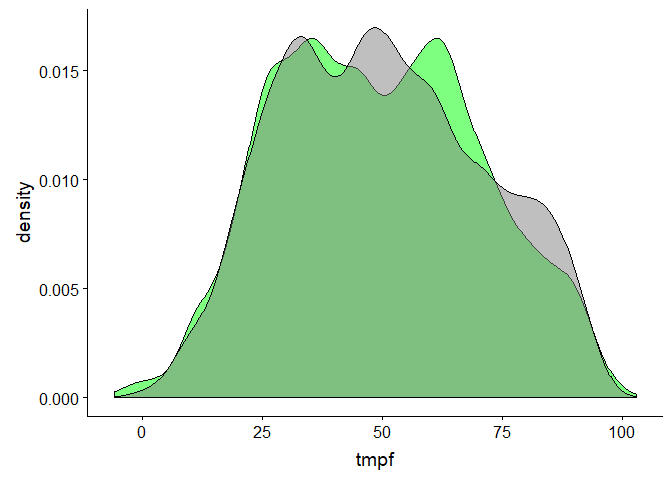
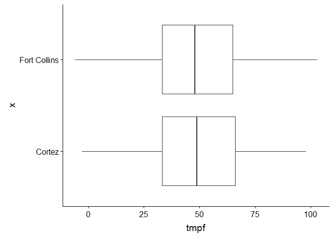
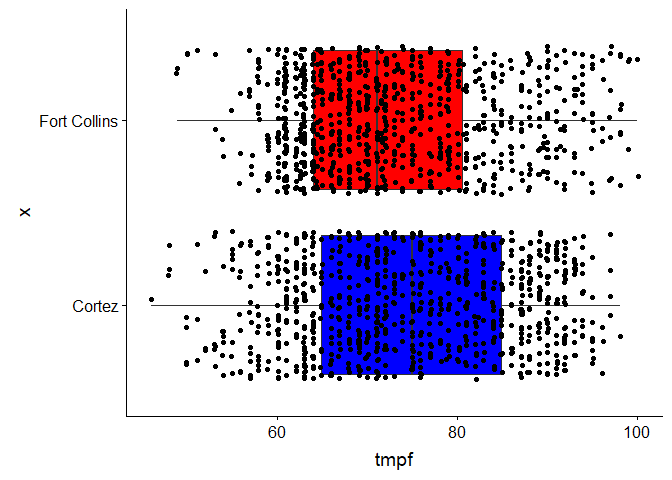
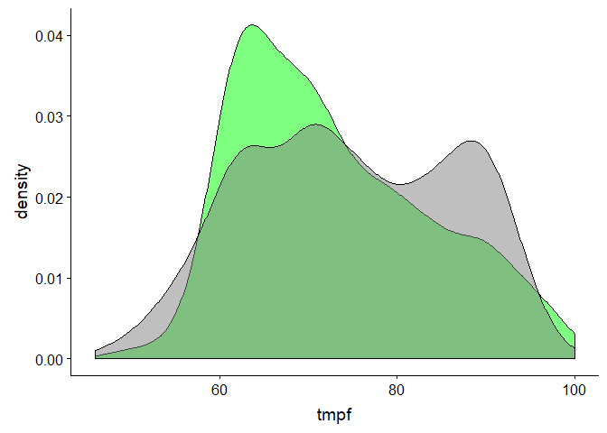
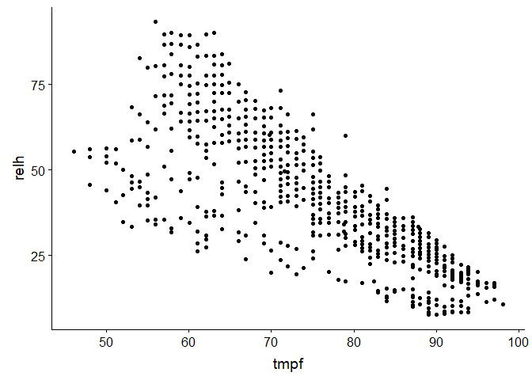
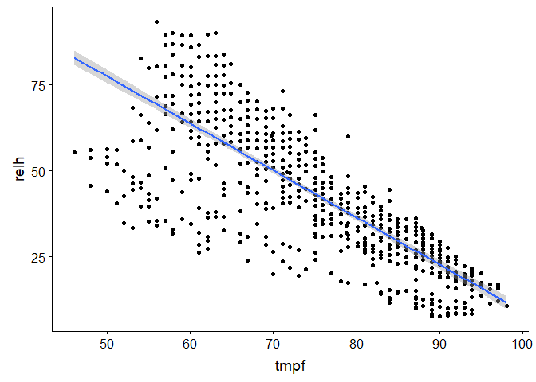

Exercise 03 - Basic Fire Weather Analyses
================

Objectives
==========

TODO:

-   Download two weather data sets
-   Graph distributions of data
-   Complete an anova

Turning on the libraries we will need:
--------------------------------------

Let's turn on `ggplot2`, `cowplot`, `riem`, and `lubridate`

``` r
library("ggplot2")
library("lubridate")
library("cowplot")
library("riem")
```

Downloading Weather Data
------------------------

Let's download weather data from two weather stations, one in Cortez, CO and one in Fort Collins.

``` r
FCO_2018 <- riem_measures("FNL", date_start = "2018-01-01", date_end = "2018-12-31")
CEZ_2018 <- riem_measures("CEZ", date_start = "2018-01-01", date_end = "2018-12-31")
```

Let's plot the distribution of the temperatures. First, we'll need to fix the timezones (as before).

``` r
CEZ_2018$DateTime <- with_tz(CEZ_2018$valid, "MST")
FCO_2018$DateTime <- with_tz(FCO_2018$valid, "MST")
```

Okay, let's plot the distribution of temperatures across the year:

Let's use a new geom, geom\_density, which displays a smooth histogram.

``` r
tempPlot <- ggplot()+
  geom_density(data = FCO_2018, fill = "green", aes(x = tmpf))+
  geom_density(data = CEZ_2018, fill = "gray50", aes(x = tmpf))+
  theme_cowplot()
tempPlot
```

 That's a bit tough to read though, isn't it? Let's change the transparency using the "alpha" argument.

``` r
tempPlot <- ggplot()+
  geom_density(data = FCO_2018, fill = "green", alpha = .5, aes(x = tmpf))+
  geom_density(data = CEZ_2018, fill = "gray50", alpha = .5, aes(x = tmpf))+
  theme_cowplot()
tempPlot
```

    ## Warning: Removed 100801 rows containing non-finite values (stat_density).

    ## Warning: Removed 103497 rows containing non-finite values (stat_density).



Much better.

Let's look at it as boxplots.

``` r
tempPlot <- ggplot()+
  coord_flip()+
  geom_boxplot(data = FCO_2018, aes(x= "Fort Collins", y = tmpf))+
  geom_boxplot(data = CEZ_2018, aes(x = "Cortez", y = tmpf))+
  theme_cowplot()
tempPlot
```

    ## Warning: Removed 100801 rows containing non-finite values (stat_boxplot).

    ## Warning: Removed 103497 rows containing non-finite values (stat_boxplot).



You'll see we did two new things there: 1. We flipped the axes with "coord\_flip" 2. Instead of mapping the x axes to variables, we mapped them to static values "Fort Collins" and "Cortez"

### Plotting Months

Let's add a new column and use the `lubridate` command `month` to identify the months of each date.

``` r
CEZ_2018$Month <- month(CEZ_2018$DateTime, label = TRUE)
FCO_2018$Month <- month(FCO_2018$DateTime, label = TRUE)
```

Now let's subset to JUST the July values. We'll use the `subset` function and assign the output to two new dataframes:

``` r
CEZ_2018July <- subset(CEZ_2018, Month == "Jul")
FCO_2018July <- subset(FCO_2018, Month == "Jul")
```

And plot it, including `geom_jitter`:

``` r
tempMonthPlot <- ggplot()+
  coord_flip()+
  geom_boxplot(data = FCO_2018July, fill = "red", aes(x = "Fort Collins", y = tmpf))+
  geom_boxplot(data = CEZ_2018July, fill = "blue", aes(x = "Cortez", y = tmpf))+
    geom_jitter(data = FCO_2018July, fill = "red", aes(x = "Fort Collins", y = tmpf))+
  geom_jitter(data = CEZ_2018July, fill = "blue", aes(x = "Cortez", y = tmpf))+
  theme_cowplot()
tempMonthPlot
```

    ## Warning: Removed 8745 rows containing non-finite values (stat_boxplot).

    ## Warning: Removed 8886 rows containing non-finite values (stat_boxplot).

    ## Warning: Removed 8745 rows containing missing values (geom_point).

    ## Warning: Removed 8886 rows containing missing values (geom_point).



Nice!

``` r
tempMonthPlot <- ggplot()+
  geom_density(data = FCO_2018July, fill = "green", alpha = .5, aes(x = tmpf))+
  geom_density(data = CEZ_2018July, fill = "gray50", alpha = .5, aes(x = tmpf))+
  theme_cowplot()
tempMonthPlot
```

    ## Warning: Removed 8745 rows containing non-finite values (stat_density).

    ## Warning: Removed 8886 rows containing non-finite values (stat_density).



### Challenge

-   Create two dataframes that have February weather for Cortez and Fort Collins.
-   Plot the distributions using geom\_density of February weather. Change the transparency to .75 and the colors to black and red.

Analyses
--------

Great! Let's plot just the temperature and relative humidity from July in Cortez:

``` r
windWxPlot <- ggplot(data = CEZ_2018July, aes(x = tmpf, y = relh))+
  geom_point()
windWxPlot
```

    ## Warning: Removed 8902 rows containing missing values (geom_point).

 Looking good. Now let's fit a linear model to these data:

``` r
tempRH <- lm(data = CEZ_2018July, formula = relh~tmpf)
summary(tempRH)
```

    ## 
    ## Call:
    ## lm(formula = relh ~ tmpf, data = CEZ_2018July)
    ## 
    ## Residuals:
    ##     Min      1Q  Median      3Q     Max 
    ## -40.031  -5.410   1.335   7.164  30.562 
    ## 
    ## Coefficients:
    ##              Estimate Std. Error t value Pr(>|t|)    
    ## (Intercept) 145.95846    2.69037   54.25   <2e-16 ***
    ## tmpf         -1.36937    0.03561  -38.46   <2e-16 ***
    ## ---
    ## Signif. codes:  0 '***' 0.001 '**' 0.01 '*' 0.05 '.' 0.1 ' ' 1
    ## 
    ## Residual standard error: 12.02 on 833 degrees of freedom
    ##   (8902 observations deleted due to missingness)
    ## Multiple R-squared:  0.6397, Adjusted R-squared:  0.6393 
    ## F-statistic:  1479 on 1 and 833 DF,  p-value: < 2.2e-16

We should also do an anova on the fitted model:

``` r
anova(tempRH)
```

    ## Analysis of Variance Table
    ## 
    ## Response: relh
    ##            Df Sum Sq Mean Sq F value    Pr(>F)    
    ## tmpf        1 213858  213858    1479 < 2.2e-16 ***
    ## Residuals 833 120452     145                      
    ## ---
    ## Signif. codes:  0 '***' 0.001 '**' 0.01 '*' 0.05 '.' 0.1 ' ' 1

ggplot2 can also display some models using geom\_smooth with method="lm". It will default to y~x as a format, which is what we used.

``` r
windWxPlot <- ggplot(data = CEZ_2018July, aes(x = tmpf, y = relh))+
  geom_point()+
  geom_smooth(method = "lm")
windWxPlot
```

    ## Warning: Removed 8902 rows containing non-finite values (stat_smooth).

    ## Warning: Removed 8902 rows containing missing values (geom_point).



### Challenge

-   Subset the Fort Collins data to just January
-   Plot the relationship between temperature and windspeed (sknt)
-   Fit a linear model to the relationship of temperature and relative humidity in Fort Collins in January
